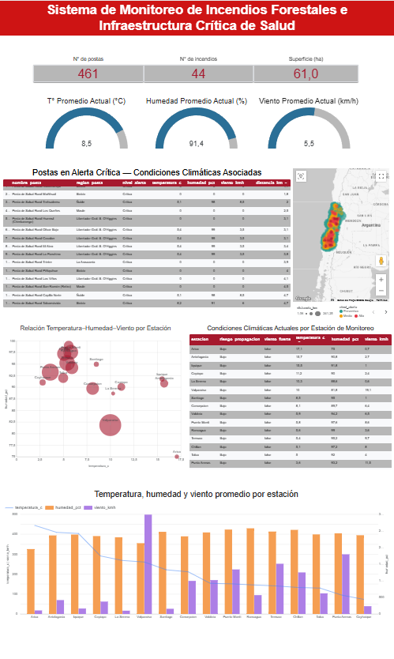
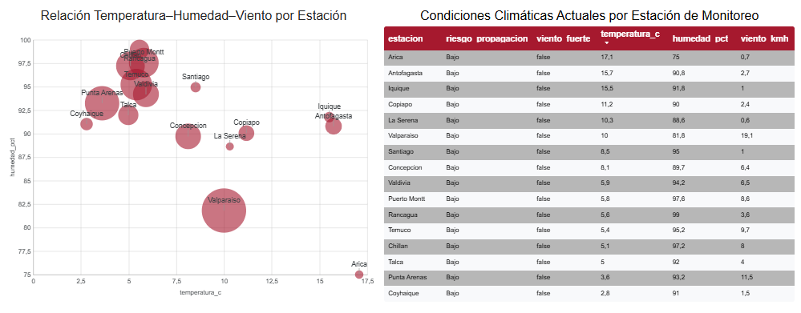
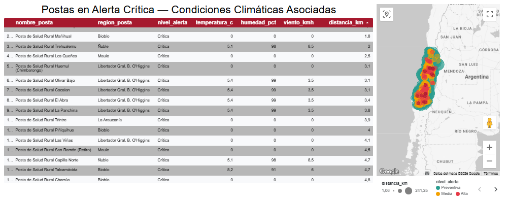

# 📊 Dashboard

Se desarrolló un dashboard interactivo en Looker Studio para visualizar información sobre incendios forestales, infraestructura crítica de salud y condiciones meteorológicas.

## Vista General:

## Análisis de Riesgo:

## Alertas para Postas Rurales:

